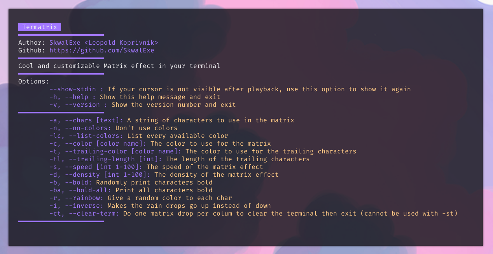
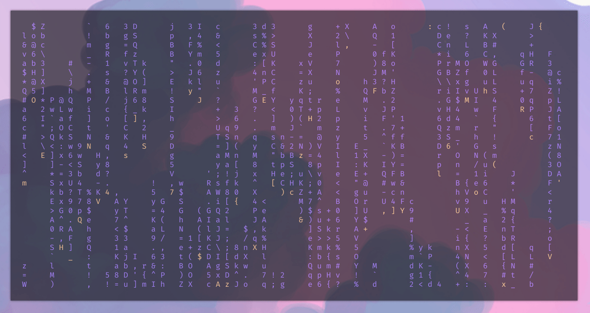

<p align="center">
  
</p>

<p align="center">
  
  
  
  
  

</p>

<p align="center">💠 Customizable matrix effect for your terminal 💠</p>

# Installation

First, clone this repository

```bash
git clone https://github.com/SkwalExe/termatrix
cd termatrix
```

Then, install the dependencies

```bash
pip3 install -r requirements.txt
```

And finally, launch the program and follow the instructions

```bash
python3 src/main.py
```

# Usage



# Preview



# Development 

Please, open an issue if you have any suggestion or if you found a bug. I will try to fix it as soon as possible. If you want to contribute, open an empty pull request and explain what you want to do, wait for me to approve it and then you can start working on it.